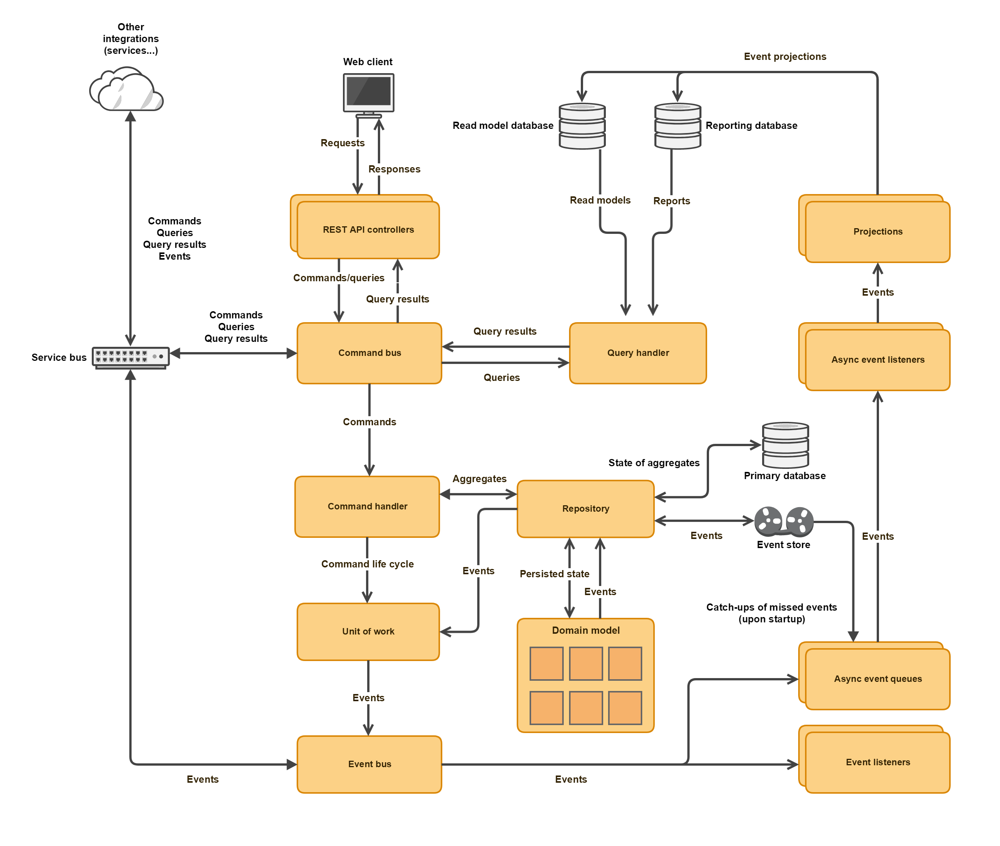

# Request life-cycle

## Overview

In Revo, a typical processing of a request consists of several distinct phases. A general overview of the data flows during a request can be seen in picture below.

## Command handlers

A processing of a request can be initiated in different ways – most often by an HTTP request received by a controller of a server API \(e.g. implemented with ASP.NET WebAPI\) or by a message received from an external service via an integration layer \(e.g. Rebus messaging via RabbitMQ\). Such request would usually trigger the processing of a command or a query. In case of a REST API request, the controller would construct a command or query based on data received from the client and send it to the _command bus_. Command bus finds a handler responsible for the command or query type. Note that if an integration layer like Rebus is configured \(see chapter 7.9\), it is also possible that the command bus will directly hand over the processing of this command/query to an external service like depicted by the diagram.

When a local handler is about to get invoked, the command/query goes through the configured processing pipeline as described in chapter 7.4.2. By default, this includes the use of a number of command filters implementing various cross-cutting concerns like authorization \(see chapter 7.11.2\) and validation \(chapter 7.12\). Very importantly, it also includes the automatic management of the _unit of work_.

## Unit of work

A new unit of work is automatically started when a command \(implementing `ICommand`\) is processed. On the other hand, queries \(implementing `IQuery<T>`\) do not start a unit of work as they should not modify the domain data \(which means they do not need a unit of work\) a this paragraph is irrelevant to their processing. The unit of work wraps the effects of a single business transaction defined by the command. When the command handler finishes, the unit of work is automatically committed, or it is canceled when the command handler fails with an exception. The unit of work commits all of its providers – i.e. most importantly, the repository. Thanks to this, it is not necessary \(or desirable\) to manually save the repository within the command handler.

Committing a repository causes that all new \(unpublished\) events from its saved aggregates get pushed to the event buffer of the current unit of work. Later, when the committing of a repository finishes, the unit of work publishes all the events queued in the event buffer. This causes the invocation of all registered synchronous event handlers, which still happens in the scope of the original request \(i.e. as a blocking operation, possibly on the same thread\). During this phase, the event is also dispatched to the queues of all registered asynchronous event listeners \(by invoking their event sequencers\). When the dispatching is done, the unit of work tries to pseudo-synchronously process those of the listeners who signaled `ShouldAttemptSynchronousDispatch` \(as previously explained in [chapter describing event processing](events.md#pseudo-synchronous-event-dispatch)\). This makes is possible to work with the listeners \(e.g. projections\) like if they were actually processed synchronously, while still retaining the reliability of asynchronous event delivery. When these listeners complete, the unit of work schedules the background execution of the remaining listeners, which ends its life.

### Object life-time during a request

TODO

